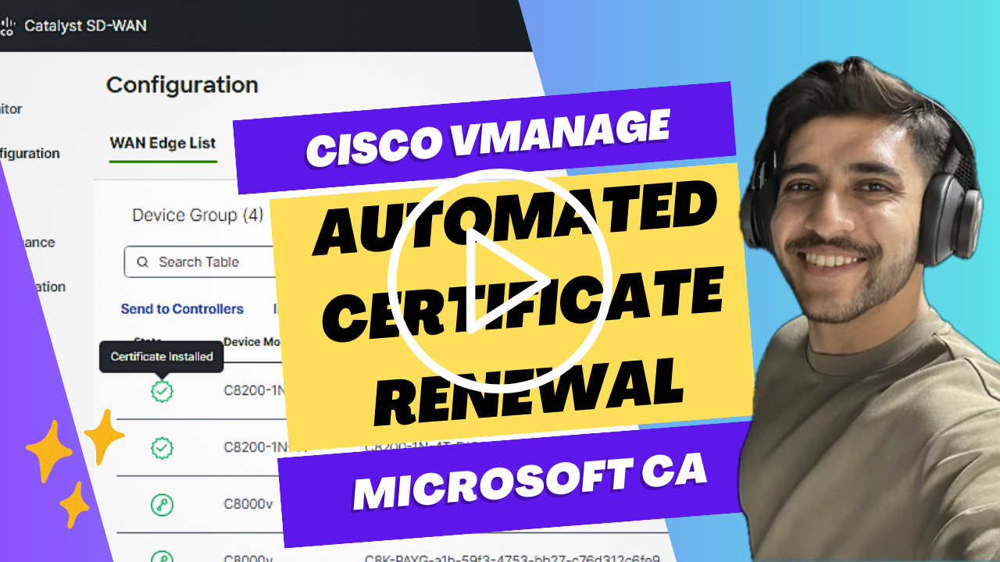
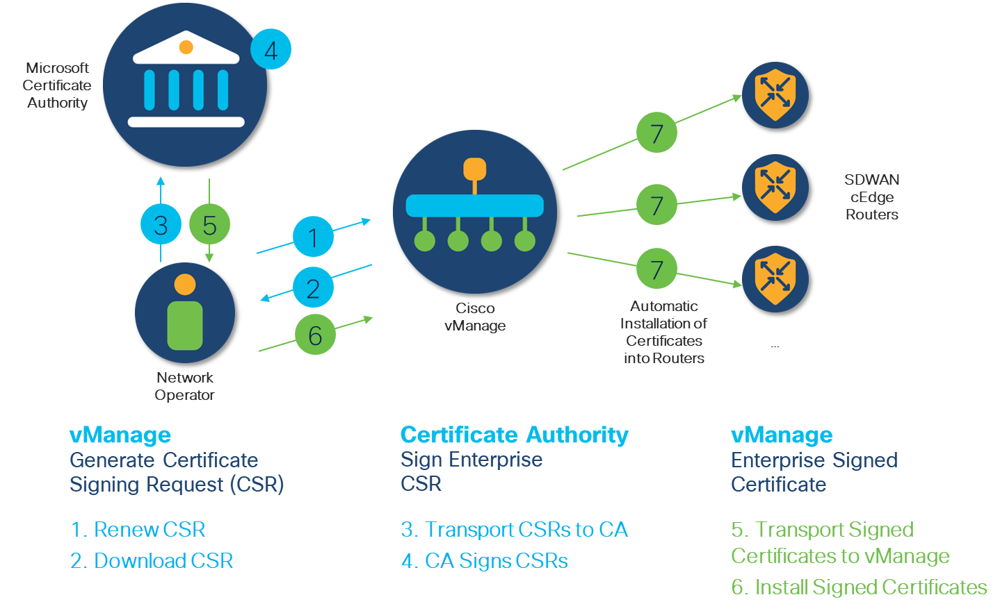

# Automated SDWAN Certificate Renewal Automation
Bulk certificate renewal of SDWAN routers via integration between SDWAN Manager/vManage and Microsoft Certificate Authority (MSFT CA).

## Demonstration of SDWAN Certificate Renewal Process

## Diagrammatic Representation of the SDWAN Certificate Renewal Process

## Incumbent Manual Workflow:
1. [Configure SDWAN vManage with Enterprise Root Certificate (CA)](https://www.cisco.com/c/en/us/td/docs/solutions/CVD/SDWAN/cisco-sdwan-controller-cert-deploy-guide.html#Option3EnterpriseRootCertificateAuthorityCA) 
2. [Get the Certificate Signing Request (CSR) signed by the Certificate Authority](https://virtuallythere.blog/2018/04/27/making-things-a-bit-more-secure-part-2/)

## Automated Developer Workflow:
1. Run `pip install -r requirements.txt` to install all prerequisite packages to operate the script
2. Navigate to the `Cisco-SDWAN-Certificate-Renewal/Authentication` folder, and create a `.env` file. Create the following environment variables: `CERTIFICATE_AUTHORITY_URL`, `VMANAGE_BASE_URL`, `VMANAGE_USERNAME`, `VMANAGE_PASSWORD`. Ensure this file is protected, `authentication.py` will make references to this file when creating vManage and CA session objects. 
3. Navigate to the root directory (i.e., `Cisco-SDWAN-Certificate-Renewal`), and run `py main.py`. The following actions will take place.
    - SDWAN device list will be pulled from the vManage inventory.
    - Certificate Signing Requests (CSRs) will be invoked for all devices in the device list. This script largely focuses on the renewal of certificates for routers, but those of controllers can also be renewed. Please uncomment out the code pertaining to controller renewal in `certificate_renewal.py`. 
    - The CSRs will be uploaded to the `Pending` folder of the Certificate Authority (CA). A network administrator needs to select all pending requests and sign them.
    - Upon confirmation of the certificates being signed, the signed certificates will be retrieved from the CA and uploaded to vManage.
    - Signed certificates will be installed into all the devices by vManage.

_This is a passion project by me, and I would love to receive suggestions/advice on how I can improve this automation workflow. I can be reached via rodev@cisco.com._

